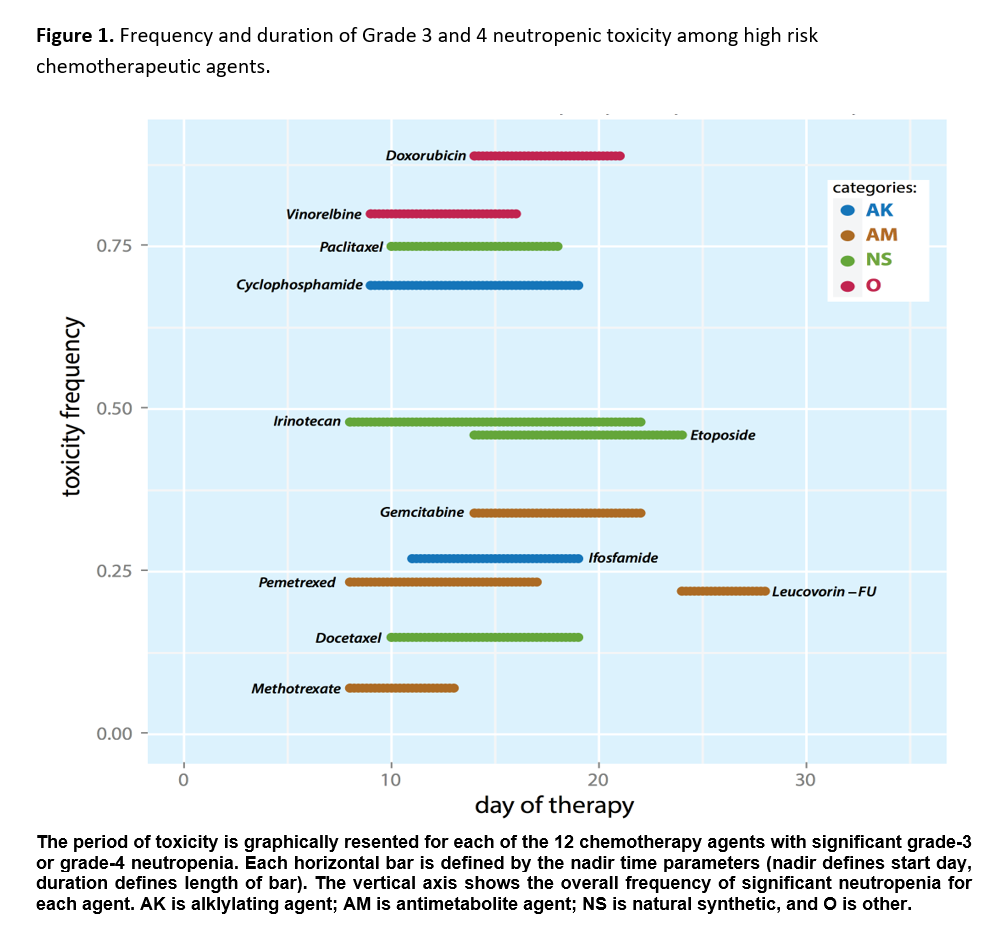
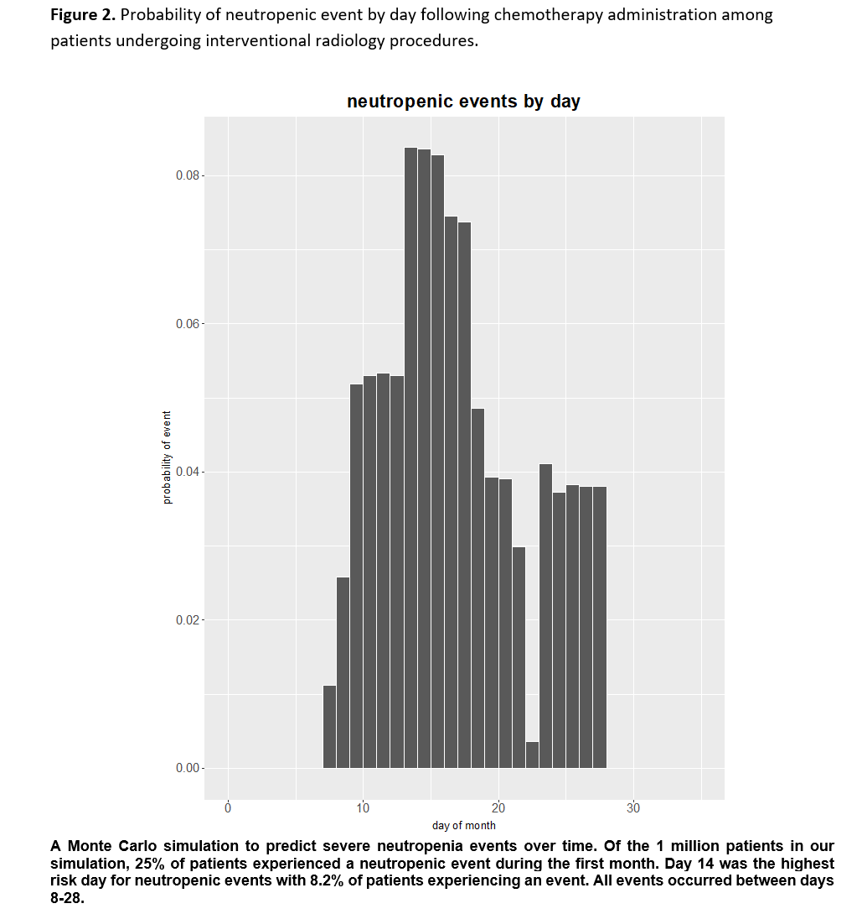

# Monte Carlo simulation for predicting chemotherapy induced neutropenia

This code was used to generate the results for our abstract.

Goel, A., Covey, A., Brody, L., Robson, P., Brown, K., & Erinjeri, J. (2016). Predicting chemotherapy induced neutropenia in patients undergoing interventional radiology procedures: a Monte Carlo simulation. Journal of Vascular and Interventional Radiology, 3(27), S287-S288.

### Frequency and duration of neutropenic toxicity was a primary input for this simulation.

Please see the abstract for full details.

### Simulation output. Probability of neutropenic event by day.

